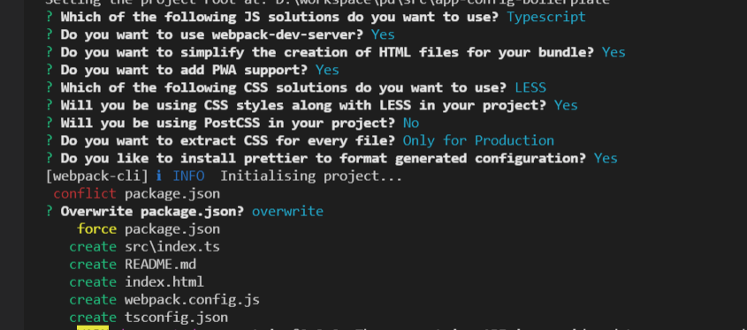
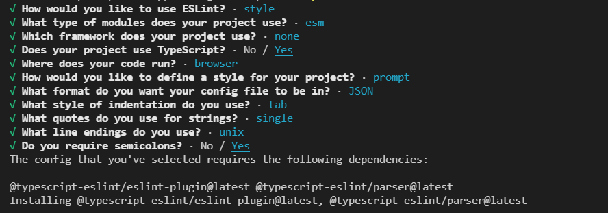

[< Back to root](../../readme.md)

# Project setup

* `npm init` to setup package.json file.

* Run `npm i -g webpack-cli` to install webpack cli.

* `npx webpack-cli init` to setup webpack configuration and generate boilarplate.



* Add output folder to .gitignore (*dist* is a default name)

# Setup babel

* Install packages

	```
	npm install --save-dev babel-loader @babel/core @babel/cli @babel/preset-env
	```

* Change webpack.config rule for ts files in order to use babel.
Change `loader: "ts-loader"` to `use: ["babel-loader", "ts-loader"]` (Loaders are executing from right to left) or just `loader: "babel-loader"` for [babel@7+](https://devblogs.microsoft.com/typescript/typescript-and-babel-7/). Add `options: { babelrc: true }` to use .babelrc file for configuration.

* Add **.babelrc** file to configure babel.

* Set [*targets*](https://babeljs.io/docs/en/options#targets) prop to set browser targeted (When no targets are specified: Babel will assume you are targeting the oldest browsers possible)
	This can either be a [browserslist-compatible](https://github.com/browserslist/browserslist) query:

	```
	{
		"targets": "> 0.25%, not dead"
	}
	```

	or an object of minimum environment versions to support:
	```
	{
		"targets": { "chrome": "58", "ie": "11" }
	}
	```
	Example environments: chrome, opera, edge, firefox, safari, ie, ios, android, node, electron.

* Add `"presets": ["@babel/preset-env"]` to use [latest syntax and polifils](https://babeljs.io/docs/en/babel-preset-env).

# Code formatting

* Install Eslint
	```
	npm install eslint --save-dev
	```

* Init eslint running
	```
	npx eslint --init
	```

	

* Install prettier and [eslint-config-prettier](https://github.com/prettier/eslint-plugin-prettier) to align prettier and eslint rules.
	```
	npm install eslint-config-prettier prettier --save-dev
	```
* Add *plugin:prettier/recommended* as the last extension in your .eslintrc
	```
	"extends": [
		"eslint:recommended",
		"plugin:@typescript-eslint/recommended",
		"plugin:prettier/recommended"
	]
	```
* Create [.prettierrc](https://prettier.io/docs/en/configuration.html) config

	Example:
	```
	{
		"trailingComma": "es5",
		"tabWidth": 2,
		"semi": true,
		"singleQuote": true
	}
	```
# Precommit hook

* Install husky and lint-staged

	```
		npm install --save-dev husky lint-staged
		npx husky install
		npm set-script prepare "husky install"
		npx husky add .husky/pre-commit "npx lint-staged"
	```
* Add the following to your package.json

	```
	{
		"lint-staged": {
			"**/*": "prettier --write --ignore-unknown"
		}
	}
	```

	** Simpler option could be `npx mrm lint-staged`. [More options](https://prettier.io/docs/en/precommit.html)